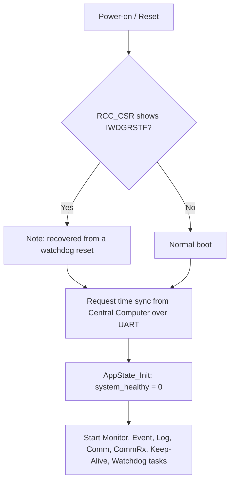

# Init (Firmware)

Runs once at boot, before any other task starts. Reads the reset-cause
register, syncs the clock, then hands off.

```mermaid
graph TD
  A[Power-on / Reset] --> B{RCC_CSR shows IWDGRSTF?}
  B -->|Yes| C[Note: recovered from a watchdog reset]
  B -->|No| D[Normal boot]
  C --> E[Request time sync from Central Computer over UART]
  D --> E
  E --> F[AppState_Init: system_healthy = 0]
  F --> G[Start Monitor, Event, Log, Comm, CommRx, Keep-Alive, Watchdog tasks]
```

Source: `StartInitTask` in `Core/Src/main.c`, `app_state.c`.
