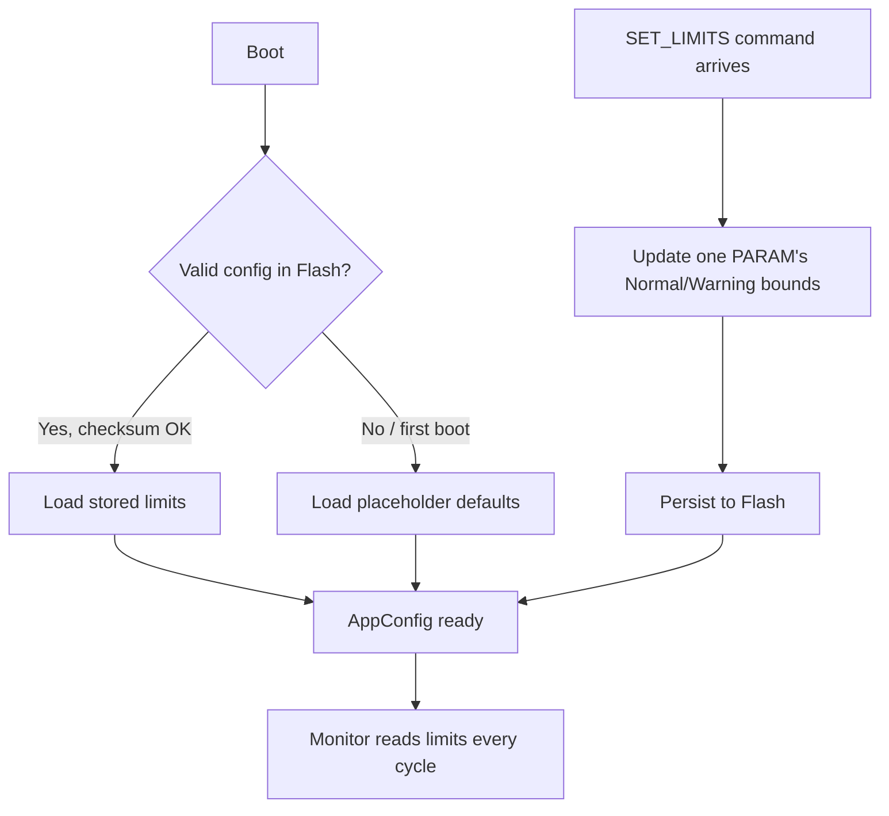

# Configuration (Firmware)

Owns the Normal/Warning limit table (temp, humidity, light, battery) that
Monitor classifies readings against. Backed by the last Flash page so
limits survive a reset.

Source: `app_config.c/.h`, `flash_config_store.c/.h`.
