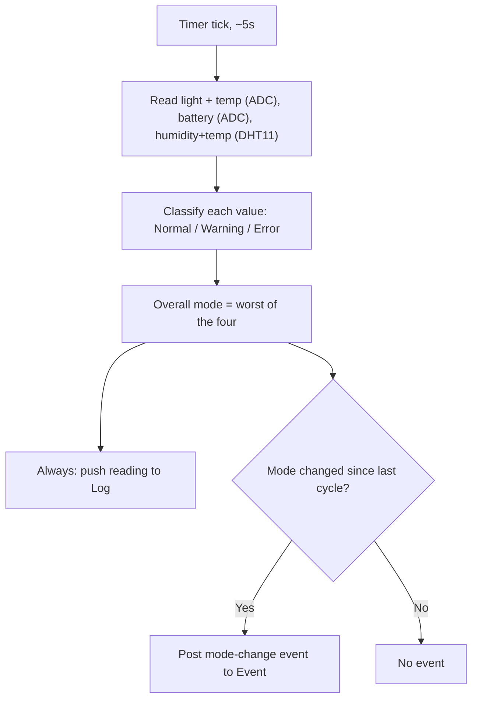

# Monitor (Firmware)

Runs on a periodic timer, reads all four sensor values, classifies each
against Configuration's limits, and only bothers Event when the overall
mode actually changes.

Source: `tasks/task_monitor.c`, `sensors_adc.c`, `dht11.c`.
