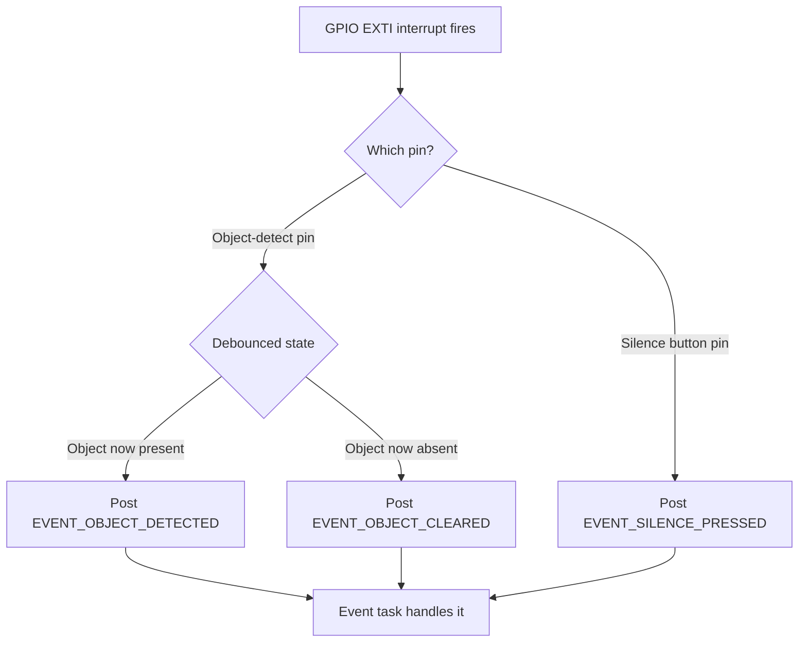

# Object Detection & Silence Button (Firmware)

Both are EXTI (interrupt) driven, not a polling task - the ISR posts
straight to the Event queue for the lowest possible latency.

Source: `stm32l4xx_it.c` (EXTI callback), `buttons.c/.h`.
