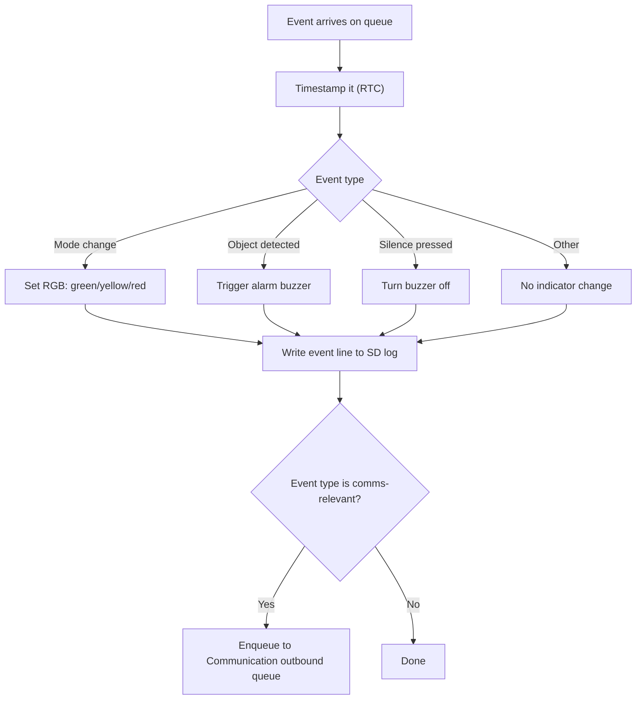

# Event (Firmware)

The single consumer of the event queue - fed by Monitor (mode changes),
the EXTI ISR (object/silence), Configuration, and Init. Owns the RGB LED
and buzzer exclusively.

Source: `tasks/task_event.c`, `indicators.c/.h`.
