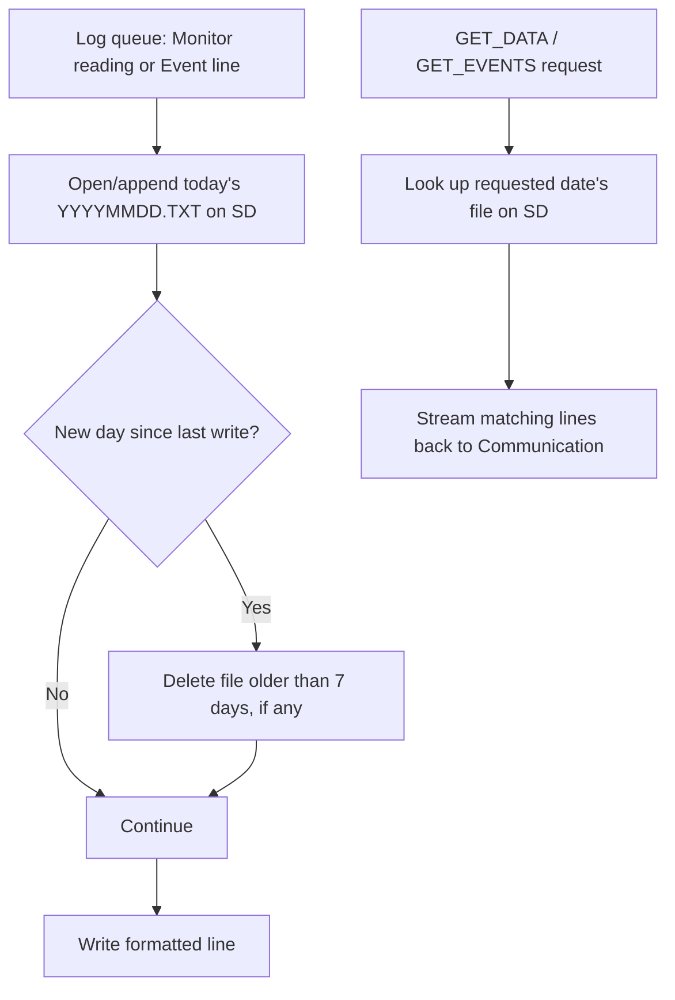

# Log & Retrieval (Firmware)

Writes both periodic Monitor readings and Event log lines to date-named
files on the SD card, with 7-day rolling retention; also serves
GET_DATA/GET_EVENTS retrieval requests from the same files.

Source: `tasks/task_log.c`, `app_log.c/.h`, `log_query.c/.h`, `sdcard.c/.h`.
