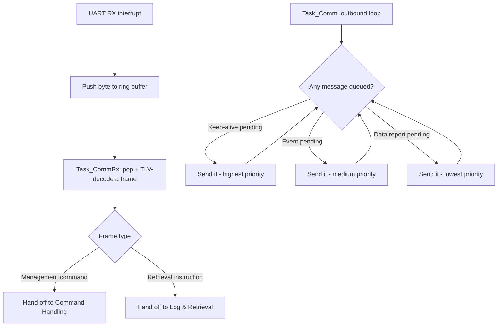

# Communication (Firmware)

Two tasks either side of one TLV-framed UART link: CommRx parses inbound
bytes and routes them; Comm drains a priority-ordered outbound queue.

Source: `tasks/task_comm.c`, `tasks/task_comm_rx.c`, `app_comm.c/.h`,
`uart_rx.c/.h`, and the shared `tlv.c/comm_frame.c` (also compiled
unmodified into the PC app - see `central-computer/`).
