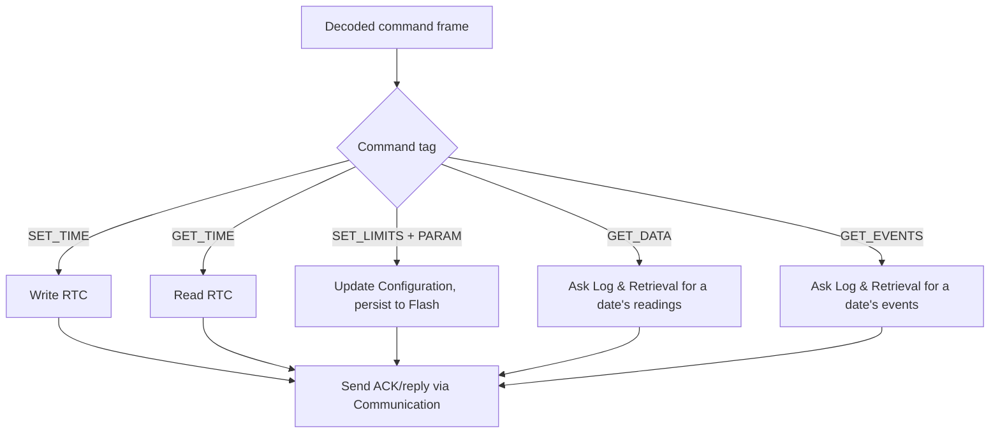

# Command Handling (Firmware)

The inbound side of Communication: turns a decoded command frame into an
actual action, then replies.

```mermaid
graph TD
  A[Decoded command frame] --> B{Command tag}
  B -->|SET_TIME| C[Write RTC]
  B -->|GET_TIME| D[Read RTC]
  B -->|SET_LIMITS + PARAM| E[Update Configuration, persist to Flash]
  B -->|GET_DATA| F[Ask Log & Retrieval for a date's readings]
  B -->|GET_EVENTS| G[Ask Log & Retrieval for a date's events]
  C --> H[Send ACK/reply via Communication]
  D --> H
  E --> H
  F --> H
  G --> H
```

Source: `app_command.c/.h`.
