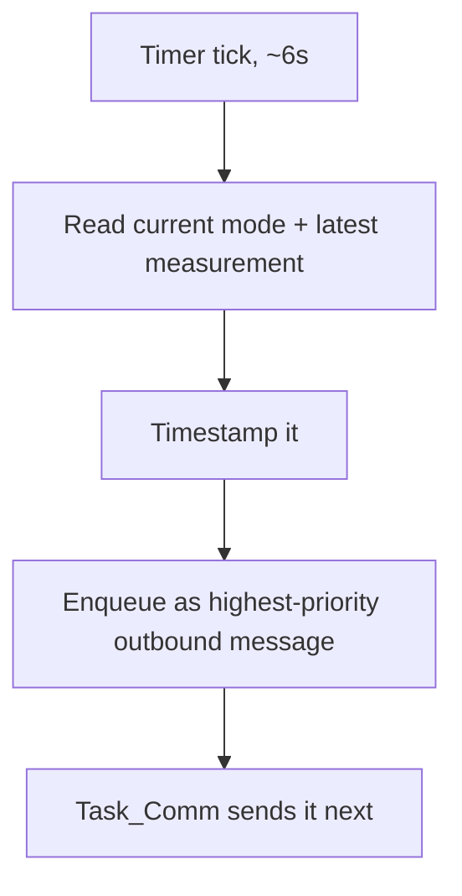

# Keep-Alive (Firmware)

A simple periodic timer task - proves to the Central Computer that the
LNC is alive even when nothing else is happening.

```mermaid
graph TD
  A[Timer tick, ~6s] --> B[Read current mode + latest measurement]
  B --> C[Timestamp it]
  C --> D[Enqueue as highest-priority outbound message]
  D --> E[Task_Comm sends it next]
```

Source: `tasks/task_keepalive.c`.
