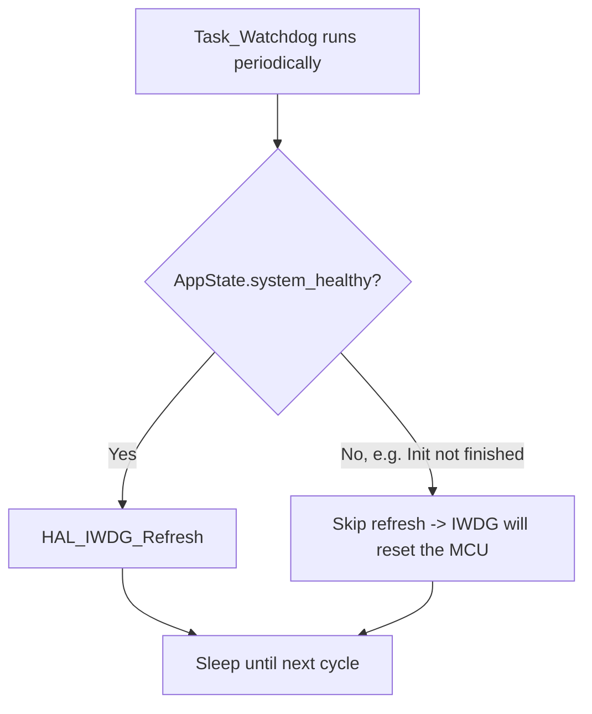

# Watchdog (Firmware)

**Status: currently disabled** (`MX_IWDG_Init()` is commented out in
`main.c` - re-enabling it previously caused unwanted resets; root cause
was tracked to `AppState`'s health gate, but re-enabling is pending an
explicit go-ahead - see `docs/SESSION_STATUS.md`).

Source: `tasks/task_watchdog.c`, `app_state.c/.h`, `main.c` (IWDG init
currently commented out).
