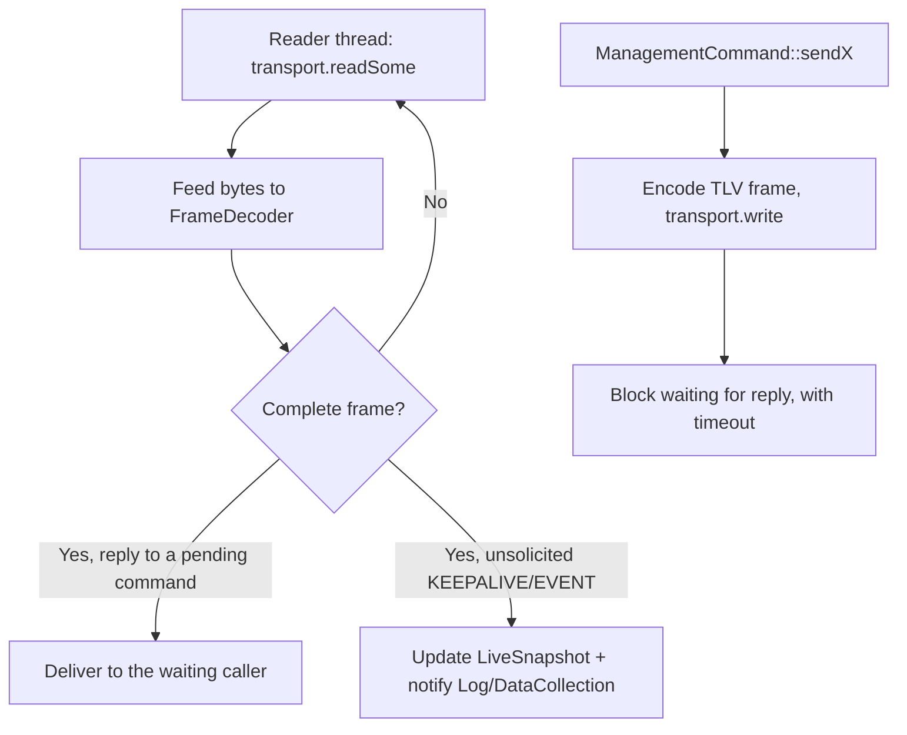

# Communication (Central Computer / PC app)

Mirrors the firmware's Communication module on the PC side - a reader
thread over a real (or loopback) transport, decoding the same TLV frames.

Source: `comm_link.h/.cpp`, `protocol_bridge.h/.cpp`,
`transport/serial_transport.h/.cpp`, `transport/loopback_transport.h`.
