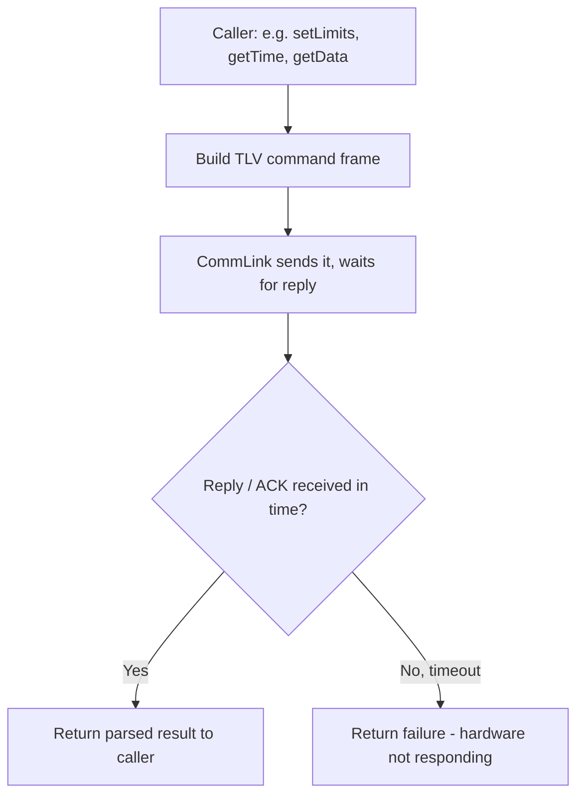

# Management Command (Central Computer / PC app)

The outward-facing API a caller (console `Menu`, or the dashboard) uses
to actually talk to the LNC - one method per command, all going through
Communication.

Source: `management_command.h/.cpp`.
