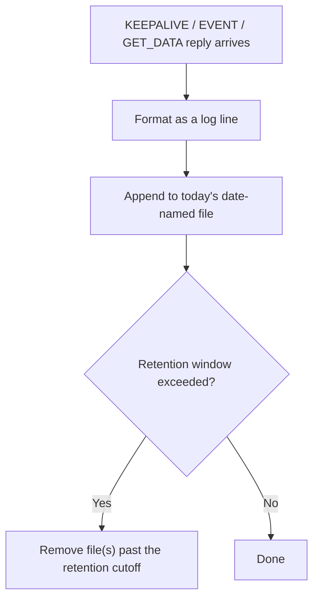

# Log (Central Computer / PC app)

Persists everything received from the LNC (data + events) to local
files, with the same day-based retention logic ported from the firmware.

Source: `log_module.h/.cpp`.
