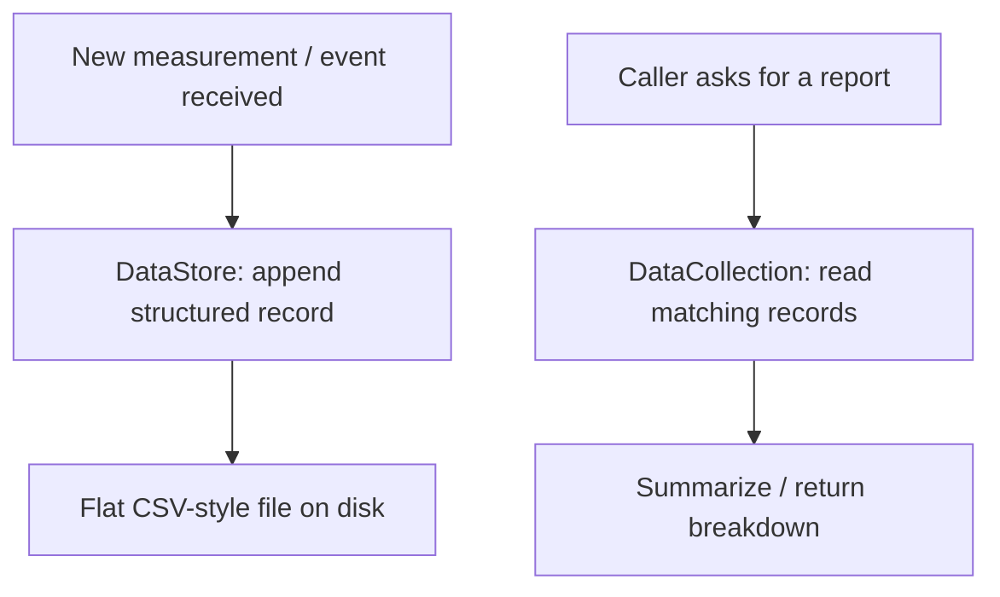

# Data Collection & Analysis (Central Computer / PC app)

Keeps a structured record store (flat-file, documented stand-in for a
real database) and answers simple report queries over it.

Source: `data_collection.h/.cpp`, `data_store.h/.cpp`.
