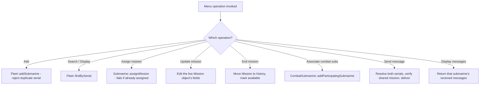

# Fleet & Menu (OOP Part)

The 10-operation console menu - pure logic in `Menu`, no I/O - operating
on `Fleet`'s owned submarines. Also the same object graph the web
dashboard drives.

Source: `menu.h/.cpp`, `fleet.h/.cpp`, `submarine.h/.cpp`,
`research_submarine.h/.cpp`, `combat_submarine.h/.cpp`, `mission.h`,
`message.h`.
