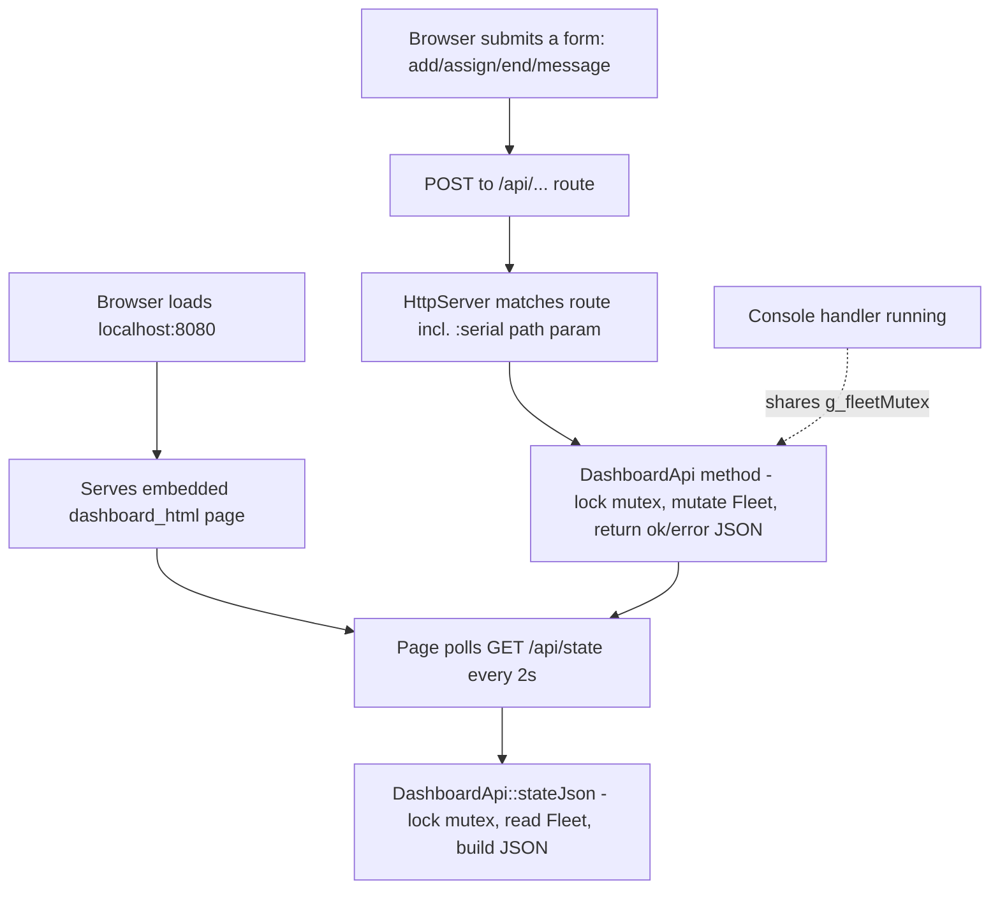

# Web Dashboard

A hand-rolled HTTP server plus a thin JSON API layer, sharing the same
live `Fleet` as the console via one mutex. Additive - the console menu
is unchanged and remains the graded deliverable.

Source: `http_server.h/.cpp`, `dashboard_api.h/.cpp`,
`dashboard_html.h/.cpp`, wired up in `main.cpp`.
